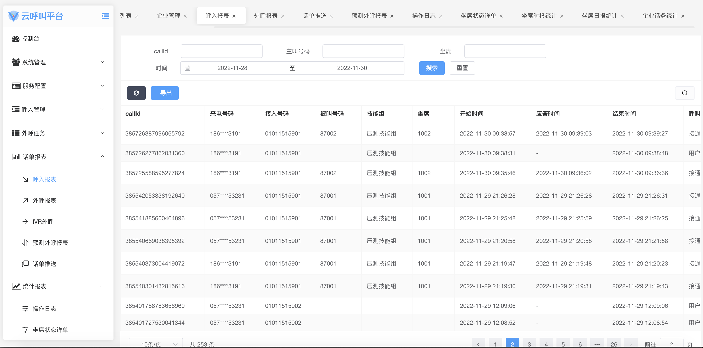
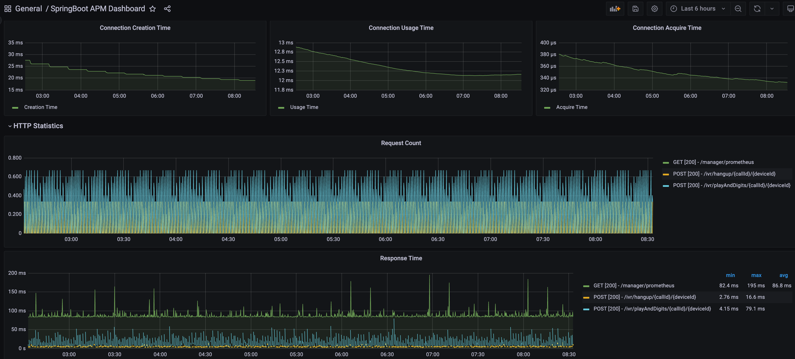
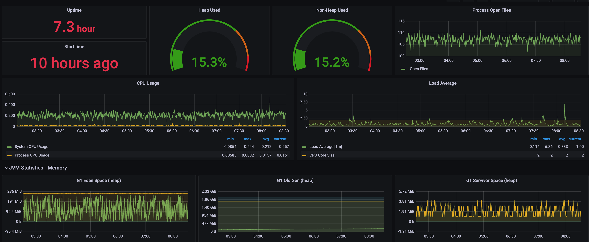
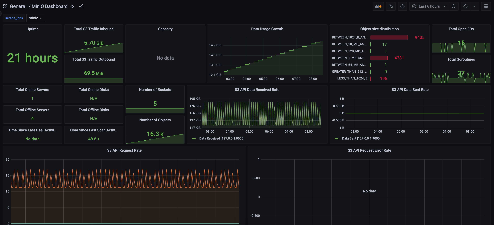

[](https://www.apache.org/licenses/LICENSE-2.0.html)

# 云呼叫中心

## 目标：构建一套百万级语音通信平台

## 支持功能点
* 支持sdk接入语音平台
* 支持webrtc
* 支持rest接口接入语音平台
* 支持http ivr接入
* 支持智能对话
* 任务外呼


## 流程图
   
   
   

## 前端展示
   
   
   

## 监控
   
   

---

### freeswitch build
```shell
cd freeswitch/debian

docker-compose up -d 

#进入freeswitch控制台
./fs_cli.sh
```
   


## 演示环境
   管理端地址：https://dev.voice9.com/admin  admin 12345678 \
   座席端地址：https://dev.voice9.com/agent  1001@test 12345678 \
   文档地址:  https://voice9.com/docs.html
   
## [申请使用](https://voice9-ai.feishu.cn/share/base/form/shrcnBTPDCb28PW42wVYEHw0Saf)
   
